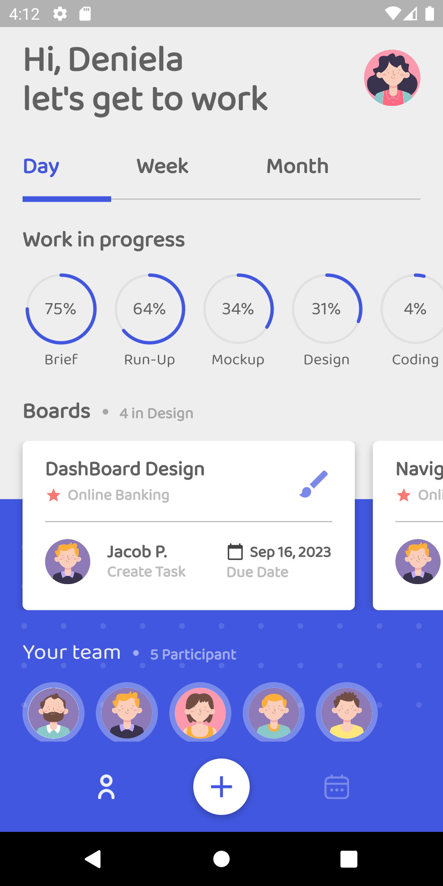
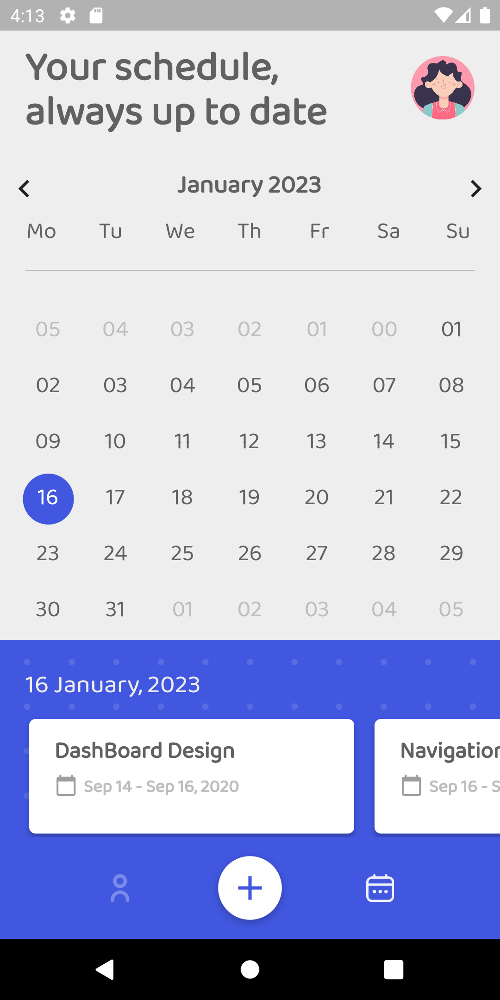

# Mighty Task

Flutter UI for handling Projects with the team

## Screenshots

Here is a screenshot of the app:

<p float="left">


</p>

## Getting Started

To run this app, you will need the Flutter SDK.

1. [Install Flutter](https://flutter.dev/docs/get-started/install)
2. Clone this repository
3. Download [Font](https://fonts.google.com/specimen/Baloo+Tammudu+2?query=baloo&preview.text=Hello%20There&preview.text_type=custom) in (copy the `.ttf` of variable weight):
```yaml
fonts:
  - family: Baloo Tammudu 2
       fonts:
         - asset: assets/fonts/BalooTammudu2.ttf
```
4. Navigate to the project directory in your terminal
5. Run `flutter run` to start the app

## Dependencies

```yaml
dependencies:
  flutter:
    sdk: flutter
  cupertino_icons: ^1.0.2
  flutter_svg: ^1.1.6
  intl: ^0.18.0
```


## Credits

- [Flutter](https://flutter.dev)
- [Dart](https://dart.dev)
